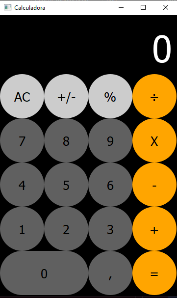

# calculadoraIphone


<div align=center>


 
  
</div>

Projeto desenvolvido durante o periodo do curso Técnico de Desenvolvimento de Sistemas SENAC sorocaba.

### Ajustes e melhorias

O projeto ainda está em desenvolvimento e as próximas atualizações serão voltadas nas seguintes tarefas:

- [x] Interface gráfica
- [x] Layout do Iphone
- [ ] Ajustar tamanho da fonte do display
- [ ] Implementar notação científica

## 💻 Pré-requisitos
 
Antes de começar, verifique se você atendeu aos seguintes requisitos:
 
- Você instalou a versão mais recente de `<python 3.12>`
- Você tem uma máquina `<Windows / Linux>`.
- Configurado o ambiente virtual:
    - `python -m venv env`
- instalação das dependencias
    -`PyQt5`
    -`auto-py-to-exe`
- Você leu `<guia / link / documentação_relacionada_ao_projeto>`.
 
## 🚀 Instalando <calculadoraIphone>
 
Para instalar a Calculadora Iphone, siga estas etapas:
 
Windows:
 
```
python -m venv env
env\Scripts\Activate.ps1
python -m pip install pyqt5
python -m pip install auto-py-to-exe
```

## ☕ Usando <calculadoraIphone>

Para usar <calculadoraIphone>, siga estas etapas:

```
<python main.py>
```

## 📫 Contribuindo para <calculadoraIphone>

Para contribuir com <calculadoraIphone>, siga estas etapas:

1. Bifurque este repositório.
2. Crie um branch: `git checkout -b <nome_branch>`.
3. Faça suas alterações e confirme-as: `git commit -m '<mensagem_commit>'`
4. Envie para o branch original: `git push origin <nome_do_projeto> / <local>`
5. Crie a solicitação de pull.

Como alternativa, consulte a documentação do GitHub em [como criar uma solicitação pull](https://help.github.com/en/github/collaborating-with-issues-and-pull-requests/creating-a-pull-request).

## 🤝 Colaboradores

Agradecemos às seguintes pessoas que contribuíram para este projeto:

<table>
  <tr>
    <td align="center">
      <a href="#" title="Surik4to06">
        <br>
        <sub>
          <b>Surik4to06 (Richard Silva Leão)</b>
        </sub>
      </a>
    </td>
  </tr>
</table>

## 📝 Licença

Ainda trabalhando em uma licença.......
